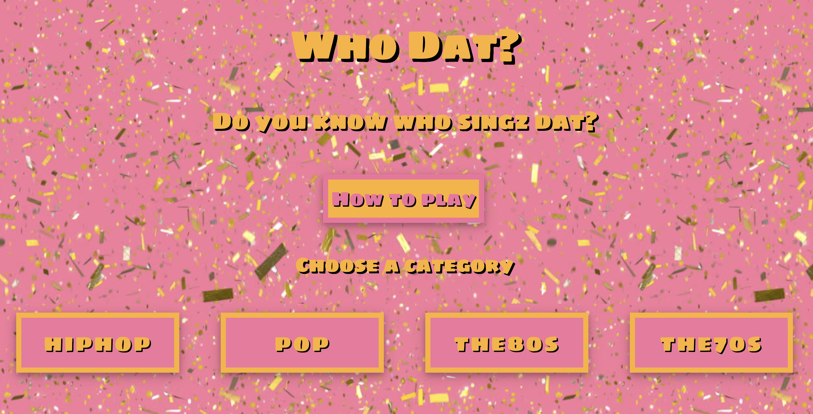

#  Project

#2: Reactathon

## Overview

The second project is to  **build a React application** that consumes a **public API**.

### Technical Requirements

Before we started the project we were given this brief, we were told that our app must:

* **Consume a public API** – this could be anything but it must make sense for your project.
* **Have several components** - At least one classical and one functional.
* **The app can include a router** - with several "pages".
* **Be deployed online** and accessible to the public.
---
# Software Engineneering Immersive: Project 2
This is my second project during the General Assembly Software Engineering Immersive course (Week 6). The project was made in collaboration with Daniela Gutperl (https://github.com/Daniela-Gutperl) and Lily Day (https://github.com/Lily-La-Day) as part of a two-day long "Reactathon".

---

# Who Dat?

This project is a multiple choice music quiz that plays a 30 second snippet of music. The player must guess the artist from four options. There are 25 questions in each category and nine categories to choose from.


## Built using

1. HTML5
2. SCSS
3. JavaScript
4. React.js
5. Consumes the Deezer API via the HTTP client Axios.


## Deployment

The quiz is deployed on Heroku and it can be found here: https://who--dat.herokuapp.com/


### The Deezer music API

We found the Deezer music API after some research and immediately found the quantity and quality of the music data available appealing. We decided to take advantage of this and use it to create a music quiz for which we wouldn't need to write questions or answers as all of the information required would be provided by the API.

Deezer's documentation can be found here: https://developers.deezer.com/api


### Challenges

The main challenge we had was that we could only make one GET request from Deezer at a time. We thought this would make it difficult to build a quiz as we wanted each category to have multiple song choices, so after studying the documentation thoroughly I found that Deezer had ready-made "radio" requests, each returning 25 song objects from similar genres which all had "preview" keys. This enabled us to allow users to pick a genre and to take a quiz composed of 25 "questions", the correct answer for each one corresponding to one of the 25 song objects.

### Home/The Choice

Users are first asked to pick from one of nine music categories, this choice then sets a corresponding category number in state which in turn is passed down to the quiz component and used to make the request to the Deezer Api.




## The Quiz

I was mainly responsible for the styling and visual aspects of the game. I decided on a colour palette of millenial pink and gold as I found this suited the fun aspect of the game rather well. I used HTML and CSS to sort the categories into columns and media queries in order to make it responsive. When viewed on a mobile device the categories on the homepage are sorted into one long column as opposed to four short ones when viewed on a laptop. I also used React to create a Modal component; clicking the 'How To Play' button opens a dashboard with game instruction and the 'Got It' button closes it.

``` import React from 'react'

const Modal = ({ handleClose, show }) => {

  return(
    <main className={show ? 'modal display-block' : 'modal display-none'}>
      <div className="modal-main">
        <p>Choose the genre you think you know best from the list of categories. A snippet of a song from that genre will start playing - use your musical wits to tell us who sang it. Remember you only have 30 seconds!</p>
        <button
          className="close-modal"
          onClick={handleClose}>
          Got it
        </button>
      </div>
    </main>
  )
}

export default Modal

```

## Future Scope
In order to further improve the functionality of this game we could have implemented user authentication in order to introduce a competition aspect to the game with multiple users scoring on a leaderboard. However, this would not have been possible in the timeframe we were given.


## Key Learnings
This project taught me a lot about how to properly read API documentation for the specific information needed to be able to make the relevant calls. It was also my first experience working as part of a group and deciding together how to portion out the work.
