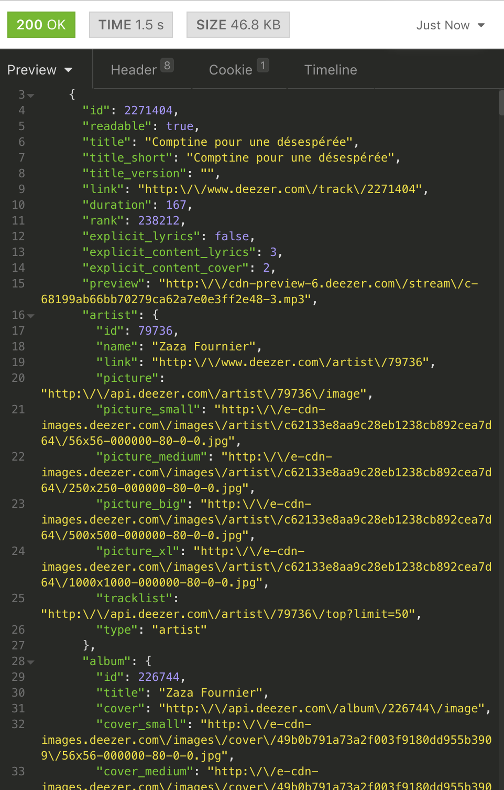
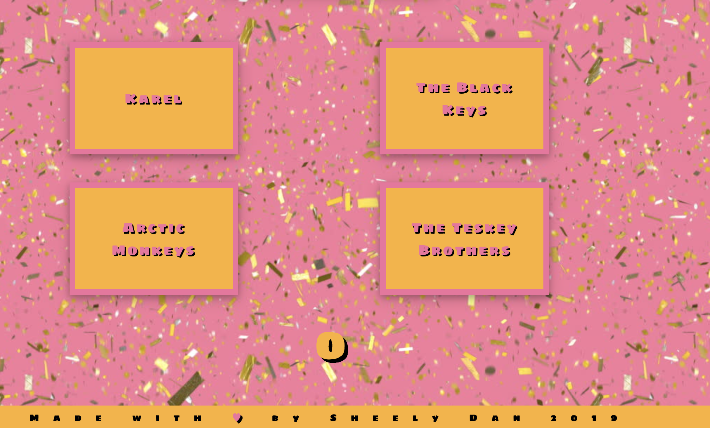

#  Project

#2: Reactathon

## Overview

The second project is to  **build a React application** that consumes a **public API**.

### Technical Requirements

Before we started the project we were given this brief, we were told that our app must:

* **Consume a public API** – this could be anything but it must make sense for your project.
* **Have several components** - At least one classical and one functional.
* **The app can include a router** - with several "pages".
* **Be deployed online** and accessible to the public.
---
# Software Engineneering Immersive: Project 2
This is my second project during the General Assembly Software Engineering Immersive course (Week 6). The project was made in collaboration with Daniel Gutperl (https://github.com/) and Sheema Khan (https://github.com/) as part of a two-day long "Reactathon".

---

# Who Dat?

This project is a multiple choice music quiz that plays snippets of music from which the player must guess the artist.

## Built using

1. HTML5
2. SCSS
3. JavaScript ES6
4. React.js (Framework)
5. Consumes the Deezer API via the HTTP client Axios.


## Deployment

The quiz is deployed on Heroku and it can be found here: https://who--dat.herokuapp.com/

## Getting Started and How to Play

If you would like to download this repository and run the code yourself simply click to "clone" and then in the terminal enter the following commands:

```
<!-- First run: -->
$ npm i
<!-- Run the app in your localhost: -->
$ npm run serve
```

You will be played a 30 second snippet of a track, your job is to guess the artist from four options. There are 25 questions in each category and nine categories to choose from.

### The Deezer music API

We found the Deezer music API after some research and immediately found the quantity and quality of the music data available appealing. We decided to take advantage of this and use it to create a music quiz for which we wouldn't need to write questions or answers. Instead Deezer would do all of the work.

Deezer's documentation can be found here: https://developers.deezer.com/api


### The Plan

Once we chose which API to use we had to decide exactly how we would use their data, we were set on using the 30 second "preview" of each track as the basis for our quiz but it wasn't initially clear how we would be able to group the songs or request them appropriately. After looking in to the documentation we found a radio request option which was ideal for our purposes, each GET request returned 25 song objects fitting a particular music genre according to the category id inserted into the URL. This enabled us to allow users to pick a genre and to take a quiz composed of 25 "questions", the correct answer for each one corresponding to one of the 25 song objects.

### Home/The Choice

Users are first asked to pick from one of nine music categories, this choice then sets a corresponding category number in state which in turn is passed down to the quiz component and used to make the request to the Deezer Api.


```js
getCategoryUrl(choice) {
  this.setState( { strForInterpol: this.state.categoryStrings[choice] })
  this.hideButtons()
}
```

### The Quiz

I was responsible for the quiz itself, making the API requests via the HTTP client Axios and writing the game logic.

```js
getData() {
  axios.get(`https://cors-anywhere.herokuapp.com/https://api.deezer.com/radio/${this.props.strForInterpol}/tracks`)

    .then(res => this.setState( { tracks: res.data.data },   () => this.getAnswers(), () => this.randomAreaFunction()))
    .catch(err => console.log(err))
}
```

This API request gives us an array of 25 songs, with each one looking like this when viewed in Insomnia:



For each question in a round we needed five things from Deezer, one snippet of music and the names of four different artists, one of whom was responsible for the snippet played. From the Json object shown, that is the value of the "artist" and "preview" keys.

This sounded simple enough as these things could all be randomly generated from the array, the unanticipated complication though was in randomly generating three incorrect answers in a random way but without duplicates. I ended up filtering the array to remove the correct answer and then segmenting the filtered array into three segments and randomly generating the incorrect answers from different segments, thus avoiding the risk of duplicating answers.

```js
this.filteredTracks = this.state.tracks.filter(track =>
  track.artist.name !== this.trackName)

this.playingSong = this.state.tracks[questionCounter].preview

randomArr[0] = this.filteredTracks[Math.floor(Math.random() * 10 )].artist.name
randomArr[1] = this.filteredTracks[Math.floor(Math.random() * 10) + 11].artist.name
randomArr[2] = this.filteredTracks[Math.floor(Math.random() * 5) + 19].artist.name

this.setState( { randomSet: randomArr })
```



The second "randomness" issue I encountered was in ensuring that the correct answer was in a different position for each quiz question. I achieved this by placing the answers in CSS "grid-areas" and then randomly generating the area for the correct answer, the other answers would then be placed in the other three areas automatically.


  The function:
```js
randomAreaFunction() {
  const randAreaArr = ['1/1', '1/2', '2/1', '2/2']
  const randArr = randAreaArr[Math.floor(Math.random() * 4)]
  return randArr
}
```

And its implementation in the JSX:

```js
<button  onClick={this.winFunction} className="Two"
  style={{gridArea: this.randomAreaFunction() }}>
  {this.trackName}
</button>
```


## Challenges and Future Improvements

This was out first group project and with the time frame being only two days a lot of the difficulties we encountered came about as a result of struggling to integrate components that we had worked on independently. We divided the project so that I focussed on the quiz itself, while my team mates worked on the home page and the styling respectively. We found the last minute amalgamation of these different parts quite challenging. An important lesson about the value of integrating as you work (via gitHub) was learned though this project was undertaken at a time before we were comfortable with this platform.

The quiz itself could be developed further by introducing user authentication, allowing people to log in and then tracking scores and including a leaderboard. We could also expand the type and breadth of questions offered as the Deezer API is a rich source of data. So rich in fact that I was eager to use it again and came back to it in my next project which can be seen here.
